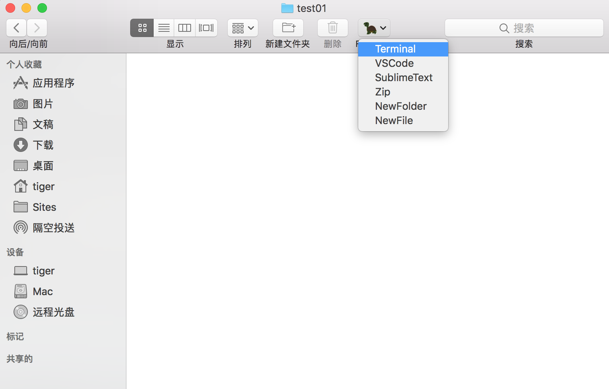
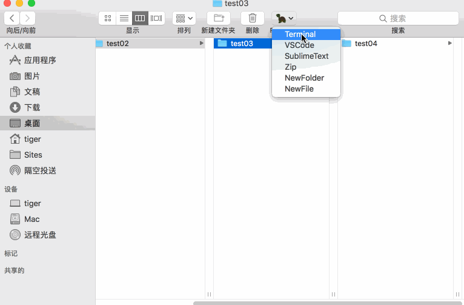

# 𝗙𝗶𝗻𝗱𝗲𝗿 𝗚𝗼-modify
Firstly,thanks for Khoa Pham! This Project is very good!
<br>原工程链接(original link)：https://github.com/onmyway133/FinderGo/

此工程是对原工程的修改，以下是修改后的使用说明：<br>
1.移除了打开iTerm、Hyper的功能。<br>
2.增加了以下功能：<br>
1）VSCode：在Visual Studio Code中打开当前文件夹。<br>
2）SublimeText：在SublimeText中打开当前文件夹。<br>
3）Zip：将当前所在的文件夹压缩成zip格式（压缩文件的格式需要在“Archive Utility”中设置）。<br>
4）newFile：创建一个新的文本文件。<br>
5）newFolder：创建一个新的文件夹。<br>

<br>

<br>

安装方法：<br>
Get the binary from https://github.com/Musk66/FinderGo-modify/releases<br>
将“FinderGo.app”拖入Applications文件夹，并将“Script”文件夹下的AppleScript脚本复制到文件夹“/Users/用户名/Library/Application Scripts/com.fantageek.FinderGo.FinderSyncExtension/目录下”，进入LaunchPad中找到FinderGo，并点击启动，此时Finder的顶部工具栏中就会出现FinderGo(🐢)的按钮，点击按钮即可根据需要选择不同的功能。<br>

----------------------------------------------------------------------------------------------------------------------------

## Original Description

<div align = "center">

<br>
<br>
</div>

## Description

- A macOS app and Finder Sync Extension to open Terminal, iTerm, Hyper from Finder
- Support macOS 10.12

## How to install

- Get the binary from https://github.com/onmyway133/FinderGo/releases

## How to use


### As a macOS application

- Support `iTerm` for now

#### How to use
- Right click on app to open, because this is not from AppStore
- Cmd+Drag app icon into Finder toolbar

### As a Finder Sync Extension

- [x] Go to Terminal
- [x] Go to iTerm
- [x] Go to Hyper

<div align = "center">

<br>
<br>
</div>

#### How to use

- Because of sandbox, we need to copy scripts from `FinderSyncExtension/Scripts` in project to `/Library/Application Scripts/com.fantageek.FinderGo.FinderSyncExtension` by running 

```sh
curl -fsSL https://raw.githubusercontent.com/onmyway133/FinderGo/master/install.sh | sh
```

- Check for `System Preferences` -> `Extensions` -> `Finder` to enable `FinderGo` if it is not enabled yet


- Right click on Finder toolbar -> `Customize Toolbar`, then Cmd+Drag `FinderGo` onto toolbar


## Credit

- Icon http://emojione.com/

## Author

Khoa Pham, onmyway133@gmail.com

## License

**FinderGo** is available under the MIT license. See the [LICENSE](https://github.com/onmyway133/FinderGo/blob/master/LICENSE.md) file for more info.
